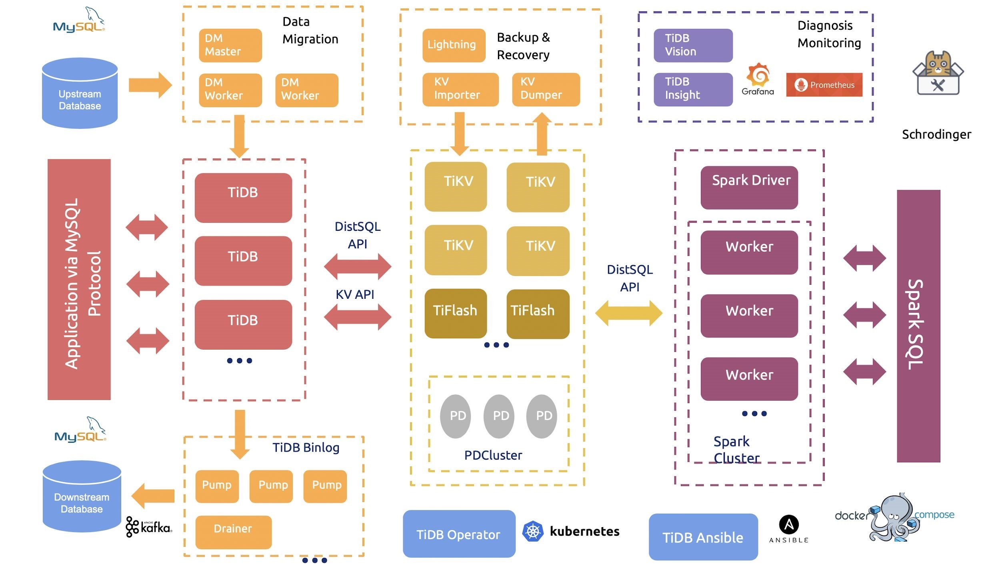

<!-- tags: pingcap -->
<!-- created: 2020-08-11 13:29 -->

# High Performance TiDB

> [TiDB](https://docs.pingcap.com/zh/tidb/stable) 是 PingCAP 公司自主设计、研发的开源分布式关系型数据库，是一款同时支持在线事务处理与在线分析处理 (Hybrid Transactional and Analytical Processing, HTAP）的融合型分布式数据库产品，具备水平扩容或者缩容、金融级高可用、实时 HTAP、云原生的分布式数据库、兼容 MySQL 5.7 协议和 MySQL 生态等重要特性。目标是为用户提供一站式 OLTP (Online Transactional Processing)、OLAP (Online Analytical Processing)、HTAP 解决方案。TiDB 适合高可用、强一致要求较高、数据规模较大等各种应用场景。

<!-- more -->

### 五大核心特性

- 一键水平扩容或者缩容

    得益于 TiDB 存储计算分离的架构的设计，可按需对计算、存储分别进行在线扩容或者缩容，扩容或者缩容过程中对应用运维人员透明。

- 金融级高可用

    数据采用多副本存储，数据副本通过 Multi-Raft 协议同步事务日志，多数派写入成功事务才能提交，确保数据强一致性且少数副本发生故障时不影响数据的可用性。可按需配置副本地理位置、副本数量等策略满足不同容灾级别的要求。

- 实时 HTAP

    提供行存储引擎 TiKV、列存储引擎 TiFlash 两款存储引擎，TiFlash 通过 Multi-Raft Learner 协议实时从 TiKV 复制数据，确保行存储引擎 TiKV 和列存储引擎 TiFlash 之间的数据强一致。TiKV、TiFlash 可按需部署在不同的机器，解决 HTAP 资源隔离的问题。

- 云原生的分布式数据库

    专为云而设计的分布式数据库，通过 TiDB Operator 可在公有云、私有云、混合云中实现部署工具化、自动化。

- 兼容 MySQL 5.7 协议和 MySQL 生态

    兼容 MySQL 5.7 协议、MySQL 常用的功能、MySQL 生态，应用无需或者修改少量代码即可从 MySQL 迁移到 TiDB。提供丰富的数据迁移工具帮助应用便捷完成数据迁移。

### 四大核心应用场景

- 对数据一致性及高可靠、系统高可用、可扩展性、容灾要求较高的金融行业属性的场景

    众所周知，金融行业对数据一致性及高可靠、系统高可用、可扩展性、容灾要求较高。传统的解决方案是同城两个机房提供服务、异地一个机房提供数据容灾能力但不提供服务，此解决方案存在以下缺点：资源利用率低、维护成本高、RTO (Recovery Time Objective) 及 RPO (Recovery Point Objective) 无法真实达到企业所期望的值。TiDB 采用多副本 + Multi-Raft 协议的方式将数据调度到不同的机房、机架、机器，当部分机器出现故障时系统可自动进行切换，确保系统的 RTO <= 30s 及 RPO = 0 。

- 对存储容量、可扩展性、并发要求较高的海量数据及高并发的 OLTP 场景

    随着业务的高速发展，数据呈现爆炸性的增长，传统的单机数据库无法满足因数据爆炸性的增长对数据库的容量要求，可行方案是采用分库分表的中间件产品或者 NewSQL 数据库替代、采用高端的存储设备等，其中性价比最大的是 NewSQL 数据库，例如：TiDB。TiDB 采用计算、存储分离的架构，可对计算、存储分别进行扩容和缩容，计算最大支持 512 节点，每个节点最大支持 1000 并发，集群容量最大支持 PB 级别。

- Real-time HTAP 场景

    随着 5G、物联网、人工智能的高速发展，企业所生产的数据会越来越多，其规模可能达到数百 TB 甚至 PB 级别，传统的解决方案是通过 OLTP 型数据库处理在线联机交易业务，通过 ETL 工具将数据同步到 OLAP 型数据库进行数据分析，这种处理方案存在存储成本高、实时性差等多方面的问题。TiDB 在 4.0 版本中引入列存储引擎 TiFlash 结合行存储引擎 TiKV 构建真正的 HTAP 数据库，在增加少量存储成本的情况下，可以同一个系统中做联机交易处理、实时数据分析，极大地节省企业的成本。

- 数据汇聚、二次加工处理的场景

    当前绝大部分企业的业务数据都分散在不同的系统中，没有一个统一的汇总，随着业务的发展，企业的决策层需要了解整个公司的业务状况以便及时做出决策，故需要将分散在各个系统的数据汇聚在同一个系统并进行二次加工处理生成 T+0 或 T+1 的报表。传统常见的解决方案是采用 ETL + Hadoop 来完成，但 Hadoop 体系太复杂，运维、存储成本太高无法满足用户的需求。与 Hadoop 相比，TiDB 就简单得多，业务通过 ETL 工具或者 TiDB 的同步工具将数据同步到 TiDB，在 TiDB 中可通过 SQL 直接生成报表。

### MySQL区别

> [https://book.tidb.io/session1/chapter5/mysql-compatibility.html](https://book.tidb.io/session1/chapter5/mysql-compatibility.html)

TiDB 作为开源 NewSQL 数据库的典型代表之一，同样支持 SQL，支持事务 ACID 特性。在通讯协议上，TiDB 选择与 MySQL 完全兼容，并尽可能兼容 MySQL 的语法。因此，基于 MySQL 数据库开发的系统，大多数可以平滑迁移至 TiDB，而几乎不用修改代码。对用户来说，迁移成本极低，过渡自然。

然而，仍有一些 MySQL 的特性和行为，TiDB 目前暂时不支持或表现与 MySQL 有差异。除此之外，TiDB 提供了一些扩展语法和功能，为用户提供更多的便利。

TiDB 仍处在快速发展的道路上，对 MySQL 功能和行为的支持方面，正按 [路线图](https://pingcap.com/docs-cn/stable/roadmap/) 的规划在前行。

- 先从总体上概括 TiDB 和 MySQL 兼容策略，如下表：

| 通讯协议   | SQL语法   | 功能和行为   |
|:----|:----|:----|
| 完全兼容   | 兼容绝大多数   | 兼容大多数   |

- 截至 4.0 版本，TiDB 与 MySQL 的区别总结如下表：

|    | MySQL   | TiDB   |
|:----|:----|:----|
| 隔离级别   | 支持读未提交、读已提交、可重复读、串行化，默认为可重复读   | 乐观事务支持快照隔离，悲观事务支持快照隔离和读已提交   |
| 锁机制   | 悲观锁   | 乐观锁、悲观锁   |
| 存储过程   | 支持   | 不支持   |
| 触发器   | 支持   | 不支持   |
| 事件   | 支持   | 不支持   |
| 自定义函数   | 支持   | 不支持   |
| 窗口函数   | 支持   | 部分支持   |
| JSON   | 支持   | 不支持部分 MySQL 8.0 新增的函数   |
| 外键约束   | 支持   | 忽略外键约束   |
| 字符集   |    | 只支持 ascii、latin1、binary、utf8、utf8mb4   |
| 增加/删除主键   | 支持   | 通过 [alter-primary-key](https://pingcap.com/docs-cn/dev/reference/configuration/tidb-server/configuration-file/#alter-primary-key) 配置开关提供   |
| CREATE TABLE tblName AS SELECT stmt   | 支持   | 不支持   |
| CREATE TEMPORARY TABLE   | 支持   | TiDB 忽略 TEMPORARY 关键字，按照普通表创建   |
| DML affected rows   | 支持   | 不支持   |
| AutoRandom 列属性   | 不支持   | 支持   |
| Sequence 序列生成器   | 不支持   | 支持   |

### 生产环境的服务器建议配置

| **组件** | **CPU** | **内存** | **硬盘类型** | **网络** | **实例数量(最低要求)** |
| --- | --- | --- | --- | --- | --- |
| TiDB | 16 核+ | 32 GB+ | SAS | 万兆网卡（2 块最佳） | 2 |
| PD | 4核+ | 8 GB+ | SSD | 万兆网卡（2 块最佳） | 3 |
| TiKV | 16 核+ | 32 GB+ | SSD | 万兆网卡（2 块最佳） | 3 |
| TiFlash | 48 核+ | 128 GB+ | 1 or more SSDs | 万兆网卡（2 块最佳） | 2 |
| TiCDC | 16 核+ | 64 GB+ | SSD | 万兆网卡（2 块最佳） | 2 |
| 监控 | 8 核+ | 16 GB+ | SAS | 千兆网卡 | 1 |

### TiDB不适用的场景

> 根据官方的生产环境的服务器建议配置需求, 可见TiDB对硬件的要求还是比较高的  
> 所以如果数据量没那么大的话, 还是没必要杀鸡用牛刀

- 单机 MySQL 能满足的场景也用不到 TiDB。
- 数据条数少于 5000w 的场景下通常用不到 TiDB，TiDB 是为大规模的数据场景设计的。
- 如果你的应用数据量小（所有数据千万级别行以下），且没有高可用、强一致性或者多数据中心复制等要求，那么就不适合使用 TiDB。
